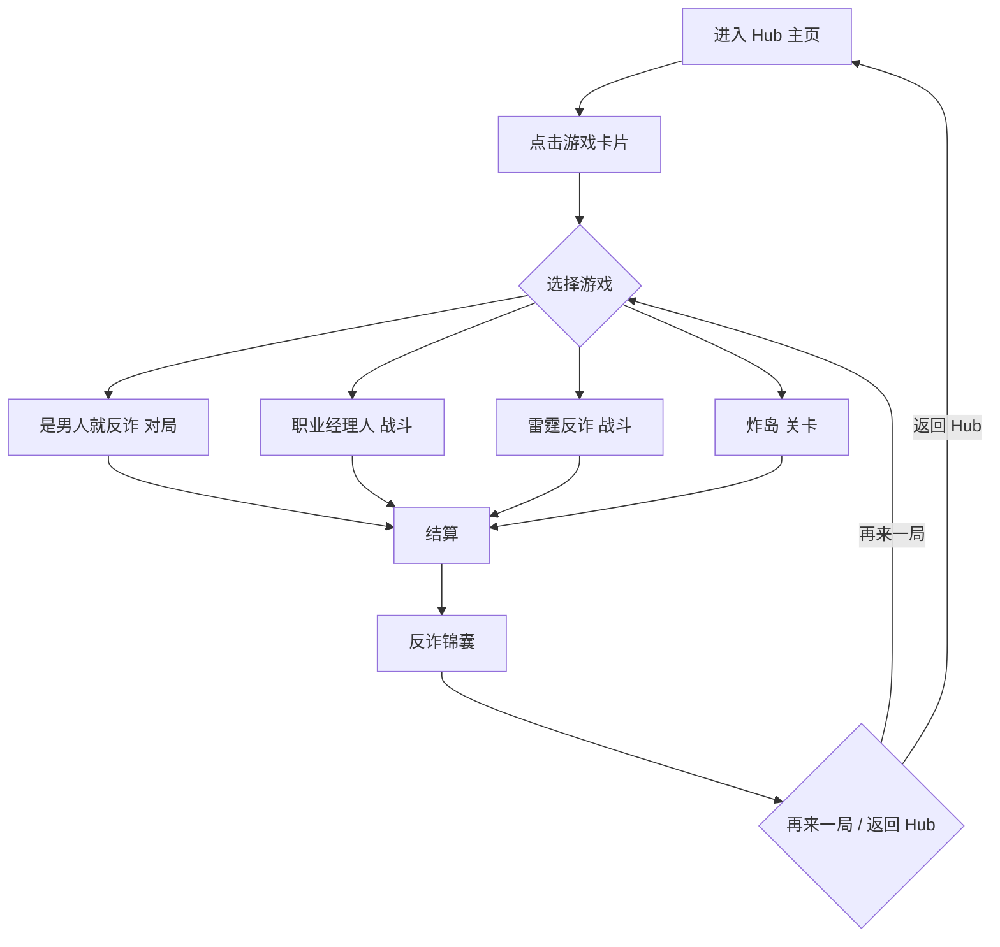

# 反诈小游戏平台 PRD

> 版本：v1.0 · 日期：2026-07-13 · 用途：交付开发实现的 HTML Demo

---

## 1. 产品概述

- **定位**：一款反电信网络诈骗主题的小游戏合集 HTML Demo 平台，承载 4 款风格各异的休闲游戏，玩家在娱乐中习得反诈知识。
- **目标**：在 Web 端打造沉浸式"全民反诈"游戏体验入口，每款游戏均可点击进入、可玩、可结算、可返回；同时演示平台级的视觉一致性与导航流畅度。
- **目标用户**：18-45 岁微信用户/PC 浏览器玩家、反诈宣传合作方、内部 demo 评审。

## 2. 核心功能

### 2.2 功能模块

1. **平台 Hub 主页**：游戏入口卡片墙 + 反诈口号 + 全局导航 + 数据看板（累计识破诈骗数 / 解锁图鉴 / 段位）
2. **游戏详情/进入页**：玩法说明 + 难度选择 + 进入按钮 + 返回 Hub
3. **4 款独立游戏**：每款均为独立的可玩单元，拥有独立的开始/对局/结算/返回流程
4. **全局悬浮菜单**：右上角"返回 Hub"按钮 + 音效开关 + 全屏切换
5. **反诈知识收尾**：每款游戏结算后展示一条反诈锦囊 + 96110 提示

### 2.3 页面详情

| 页面名称 | 模块名称 | 功能描述 |
|---|---|---|
| Hub 主页 | Hero 横幅 | 全屏主视觉，"反诈游戏平台"主标题、扫描线、警示条纹 |
| Hub 主页 | 游戏卡片墙 | 4 张大卡片（封面图、名称、副标题、玩法标签、难度、最高分），悬浮 hover 上浮 + 霓虹边光 |
| Hub 主页 | 全局数据看板 | 累计游戏时长、识破诈骗次数、当前段位、解锁图鉴数 |
| Hub 主页 | 底部权威信息条 | 96110 / 国家反诈中心 / 12321 举报 |
| 游戏-是男人就反诈 | 对局内舞台 | 卡片从底部飞入 + 倒计时进度环 + 双按钮（举报/通过）+ 拆解 Toast + HUD（波数/连击/护盾）|
| 游戏-是男人就反诈 | 结算页 | 波数/得分/最高连击/新段位/再来一局/返回 Hub |
| 游戏-反诈职业经理人 | 战前部署 | 探员卡组列表（6 名探员）+ 拖拽到 3×3 战位 + 敌方阵容预览 + 开始战斗 |
| 游戏-反诈职业经理人 | 实时战斗 | 俯视角 2D 战场，探员自动开火/释放技能，玩家点击技能图标释放大招，击破诈骗敌人 |
| 游戏-反诈职业经理人 | 战斗结算 | 胜负 + 击破统计 + 解锁图鉴 + 返回 |
| 游戏-雷霆反诈 | 战斗舞台 | 竖屏卷轴射击 Canvas，玩家飞船自动开火，拖动走位，Boss 弹幕，HUD（生命/护盾/炸弹/分数/连击）|
| 游戏-雷霆反诈 | 死亡复盘 | 红底卡片"你被 XX 诈骗击中" + 3 条识别要点 + 96110 + 重新挑战 |
| 游戏-炸岛 | 关卡选择 | 3 个电诈园区关卡（新手园/中区园/总部园）卡片 |
| 游戏-炸岛 | 弹道投掷战斗 | 侧视角地图，玩家调整角度+力度发射炮弹，命中园区建筑物得分，摧毁全部建筑过关 |
| 游戏-炸岛 | 战斗结算 | 摧毁率/弹药效率/解锁武器/下一关 |
| 全局 | 反诈锦囊弹窗 | 每局结束展示一张反诈小卡片 |

## 3. 核心流程

用户打开平台 → Hub 主页 → 点击任一游戏卡片 → 进入对应游戏详情/直接开始 → 完成 1 局对局 → 结算页 → 返回 Hub 或再来一局 → 累计数据写入 Hub 看板。

## 4. 界面设计

### 4.1 设计风格

**美学方向：警务科技 / Cyber Police Terminal**
- 主色：警务蓝 `#0A1929`（深背景）+ 执法蓝 `#1B5FCC`（主操作）+ 警示红 `#E5353B`（诈骗/危险）+ 银白 `#F0F4FF`（文字）
- 强调色：荧光青 `#00E5FF`（扫描/数据）+ 警示黄 `#FFD666`（高亮）
- 字体：标题用 `ZCOOL KuaiLe` 或 `Noto Sans SC Black`（强力中文黑体），数字/代码用 `JetBrains Mono`，正文用 `Noto Sans SC`
- 风格元素：CRT 扫描线、网格底纹、警示斜条纹、霓虹边光、glitch 故障效果、终端命令行感
- 按钮：硬朗切角（无圆角或 4px 小圆角），霓虹外发光，按下有按下感
- 布局：Hub 主页采用 4 卡片不对称网格（一大三小或 2×2），每张卡片有独特的视觉标识

### 4.2 页面设计概览

| 页面名称 | 模块名称 | UI 元素 |
|---|---|---|
| Hub 主页 | Hero | 全屏深蓝渐变 + 扫描线动画 + "反诈游戏平台"巨字 + 副标题"全民反诈 天下无诈" |
| Hub 主页 | 游戏卡片墙 | 2×2 网格，每张卡片含封面、标题、玩法标签、难度星级、最高分 |
| Hub 主页 | 数据看板 | 4 个统计卡片（识破诈骗/游戏时长/段位/图鉴），数字滚动动画 |
| 各游戏对局 | HUD | 顶部条 + 暂停按钮 + 返回 Hub 按钮 + 音效开关 |
| 各游戏对局 | Canvas 舞台 | 16:9 或 9:16 居中，背景与游戏主题契合 |
| 各游戏结算 | 卡片 | 中央卡片，分数大数字 + 段位徽章 + 双按钮 |

### 4.3 响应式

- 桌面优先（1280×800 基准），Hub 主页 2×2 卡片网格
- 平板（768-1024）：保持 2×2，卡片紧凑
- 移动端（<768）：单列卡片堆叠，雷霆反诈/炸岛改为竖屏适配
- 触控优化：所有按钮 ≥ 44px 触摸热区，雷霆反诈支持拖动操作

### 4.4 4 款游戏独立视觉个性

| 游戏 | 视觉个性 | 主色调 |
|---|---|---|
| 是男人就反诈 | 聊天界面仿真 + 卡片滑动 + 紧迫感倒计时环 | 微信绿 + 警示红 |
| 反诈职业经理人 | Q版半写实卡牌 + 战位网格 + 战术地图 | 沙盘绿 + 警务蓝 |
| 雷霆反诈 | 竖屏卷轴 + 太空科幻 + 弹幕爆裂 | 深空蓝 + 霓虹青 |
| 炸岛 | 俯视地图 + 弹道抛物线 + 摧毁爽感 | 沙漠黄 + 爆炸橙 |

## 5. 4 款游戏详细玩法（Demo 范围）

### 5.1 是男人就反诈

- **致敬**："是男人就下 100 层"
- **核心循环**：诈骗情境卡片从底部飞入 → 限时 4s 判断（举报/通过）→ 即时拆解反馈 → 连击累积 → 难度递增
- **Demo 范围**：30 张诈骗场景卡片（覆盖 6 大类）+ 8 张干扰项（非诈骗）+ 30 波无尽模式
- **失败**：3 点护盾归零
- **段位**：1/10/30 波对应反诈小白/略有警觉/是男人

### 5.2 反诈职业经理人

- **致敬**：手机游戏的"职业经理人"组建球队玩法
- **核心循环**：从 6 名探员中选择 3 名出战 → 拖拽部署到 3×3 战位 → 实时塔防式战斗 → 击破 3 波诈骗敌人 → 结算
- **Demo 范围**：6 名探员（沈锋/林书影/周衡/王婆婆/苏岩/陈默）+ 6 种诈骗敌人（话术机器人/假客服弹窗/恐吓语音/甜言蜜语/钓鱼链接/卡农）+ 1 关卡（杀猪盘战场）
- **操作**：拖拽部署 + 点击技能图标释放大招

### 5.3 雷霆反诈

- **致敬**：雷霆战机
- **核心循环**：拖动飞船走位 → 自动开火 → 击破诈骗敌人 → 拾取道具升级 → Boss 战
- **Demo 范围**：1 关（冒充公检法主题）+ 3 小波 + 1 Boss（假警察局长，3 阶段）+ 6 种道具 + 4 级火力
- **操作**：单指拖动 + 双击放炸弹

### 5.4 炸岛（原创设计）

- **致敬**：愤怒的小鸟 / 虫虫特攻队 弹道投掷
- **核心循环**：选择武器 → 调整发射角度+力度 → 抛物线弹道 → 命中电诈园区建筑 → 摧毁全部建筑过关
- **Demo 范围**：3 关（妙瓦底新手园/缅北中区园/总部核心园）+ 4 种武器（普通炮弹/燃烧弹/钻地弹/集束弹）+ 摧毁率结算
- **主题包装**：玩家扮演"反诈正义联盟"的炮兵指挥官，远程精准打击境外电诈园区，每关结算展示该园区涉及的诈骗类型与防范要点
- **操作**：鼠标拖拽瞄准 + 释放发射（弹弓式交互）+ 滚轮切换武器

## 6. 全局交互与可用性

- 进入每款游戏前展示 3 秒"反诈简报"卡片（诈骗类型 + 识别要点 + 96110）
- 全局键盘支持：Esc 返回 Hub、P 暂停、M 静音
- 局内可随时返回 Hub（带确认弹窗防误触）
- 所有结算页可一键分享（生成战报图，未实现可降级为复制文案）
- 色弱友好：状态信息不只靠颜色，辅以图标/文字

## 7. 性能与边界

- 首屏 ≤ 3s（按需加载游戏模块，Hub 主页先呈现）
- 每款游戏独立 chunk，进入时按需挂载 Canvas
- 60fps 目标（中端机型降级 30fps 时维持手感）
- Demo 不要求后端，所有数据本地 localStorage 存档

## 8. 验收标准

- [ ] Hub 主页加载流畅，4 张游戏卡片视觉差异化
- [ ] 4 款游戏均可独立进入、可玩、可结算、可返回
- [ ] 每款游戏的核心循环 1 局可完整跑通
- [ ] 全局数据看板跨游戏累计正确
- [ ] 响应式在桌面/平板/移动端均可用
- [ ] 视觉风格统一且每款游戏有独立个性
- [ ] 反诈锦囊在结算后正确展示
