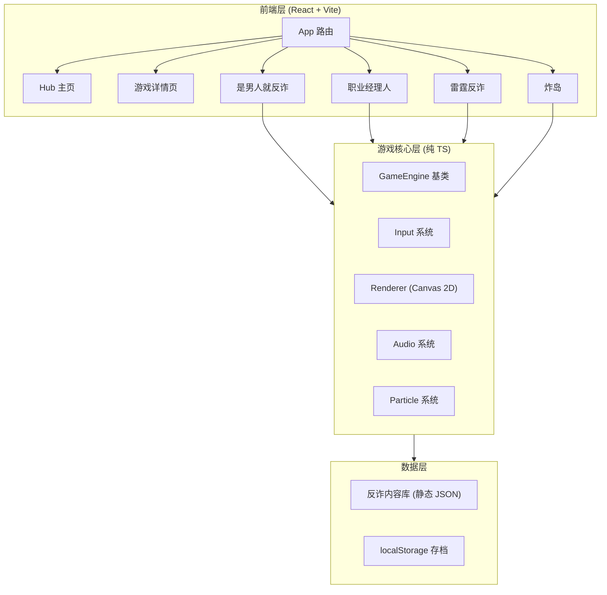

# 反诈小游戏平台 技术架构

> 版本：v1.0 · 日期：2026-07-13 · 配套 PRD.md

---

## 1. 架构设计



**关键原则**：
- 平台外壳用 React 负责 Hub / 路由 / 全局状态 / UI 容器
- 每款游戏是一个 React 组件壳 + 内部 Canvas，游戏核心逻辑用纯 TS 类驱动（不依赖 React 重渲染）
- React 与 Canvas 之间通过 `useGameEngine` Hook 桥接：React 负责 UI 与状态显示，Canvas 负责游戏渲染
- 反诈内容数据全部静态化（JSON / TS 常量），无需后端

## 2. 技术选型

| 项 | 选型 | 理由 |
|---|---|---|
| 框架 | React 18 + TypeScript | 类型安全 + 生态成熟，便于组件化平台 |
| 构建 | Vite 5 | 极速 HMR，按需 chunk 拆分各游戏 |
| 样式 | Tailwind CSS 3 | 快速原型 + 设计 token 统一 |
| 状态 | Zustand | 轻量，跨页面共享存档/设置 |
| 路由 | React Router v6 | 嵌套路由 + 懒加载游戏模块 |
| 图标 | lucide-react | 统一图标系统 |
| 动画 | Framer Motion + CSS | Hub 入场/Hover/过渡 |
| 字体 | Noto Sans SC + ZCOOL KuaiLe + JetBrains Mono | 中文标题/数字代码 |
| 游戏 | 原生 Canvas 2D | 4 款游戏均不需 WebGL，Canvas 2D 足够，包体小 |

## 3. 路由定义

| 路由 | 用途 |
|---|---|
| `/` | Hub 主页 |
| `/briefing/:gameId` | 反诈简报（进入游戏前 3 秒卡片）|
| `/play/fraud-buster` | 是男人就反诈 |
| `/play/manager` | 反诈职业经理人 |
| `/play/thunder` | 雷霆反诈 |
| `/play/bomb-island` | 炸岛 |
| `/codex` | 反诈图鉴（全局，可选） |
| `/about` | 关于/内容来源声明 |

游戏组件使用 `React.lazy` 按需加载，减小首屏体积。

## 4. 项目目录结构

```
game/
├── index.html
├── package.json
├── vite.config.ts
├── tailwind.config.js
├── tsconfig.json
├── src/
│   ├── main.tsx
│   ├── App.tsx
│   ├── routes/
│   │   ├── Hub.tsx
│   │   ├── Briefing.tsx
│   │   └── Play.tsx           # 路由分发器
│   ├── games/
│   │   ├── fraudBuster/        # 是男人就反诈
│   │   │   ├── FraudBusterGame.tsx
│   │   │   ├── engine.ts
│   │   │   ├── data.ts         # 30 张卡片数据
│   │   │   └── types.ts
│   │   ├── manager/            # 职业经理人
│   │   │   ├── ManagerGame.tsx
│   │   │   ├── engine.ts
│   │   │   ├── agents.ts       # 6 名探员
│   │   │   ├── enemies.ts      # 6 种敌人
│   │   │   └── types.ts
│   │   ├── thunder/            # 雷霆反诈
│   │   │   ├── ThunderGame.tsx
│   │   │   ├── engine.ts
│   │   │   ├── stages.ts
│   │   │   └── types.ts
│   │   └── bombIsland/         # 炸岛
│   │       ├── BombIslandGame.tsx
│   │       ├── engine.ts
│   │       ├── levels.ts
│   │       └── types.ts
│   ├── engine/                 # 公共游戏引擎
│   │   ├── GameEngine.ts       # 基类：rAF 循环、暂停、销毁
│   │   ├── Renderer.ts         # Canvas 工具：圆角矩形/文字/精灵
│   │   ├── Input.ts            # 鼠标/触摸/键盘
│   │   ├── Particle.ts         # 粒子系统
│   │   ├── Audio.ts            # 音效（WebAudio 程序化）
│   │   └── Tween.ts            # 简易缓动
│   ├── components/             # 平台 UI 组件
│   │   ├── GameCard.tsx
│   │   ├── GameShell.tsx       # 游戏外壳：HUD + Canvas + 暂停/返回
│   │   ├── BriefingCard.tsx
│   │   ├── ResultCard.tsx
│   │   ├── AntiFraudTip.tsx
│   │   └── ScanlineOverlay.tsx
│   ├── store/                  # Zustand 全局状态
│   │   ├── usePlatformStore.ts # 段位/累计数据/解锁
│   │   └── useSettingsStore.ts # 音效/震动/全屏
│   ├── data/
│   │   ├── fraudScenes.ts      # 反诈场景库（共享）
│   │   ├── codex.ts            # 图鉴
│   │   └── tips.ts             # 反诈锦囊池
│   ├── hooks/
│   │   └── useGameEngine.ts    # 桥接 React 与 Canvas 游戏引擎
│   ├── styles/
│   │   ├── globals.css
│   │   └── theme.ts            # 设计 token
│   └── types/
│       └── index.ts
└── public/
    └── fonts/                  # 中文字体子集化
```

## 5. 核心数据结构

### 5.1 平台级状态（Zustand）

```ts
interface PlatformState {
  totalFoolsBusted: number;     // 累计识破诈骗数
  totalPlayTimeSec: number;
  rank: '反诈小白' | '略有警觉' | '是男人' | '反诈达人' | '反诈教头' | '反诈之神';
  unlockedCodex: string[];       // 已解锁图鉴 typeId
  bestScores: Record<GameId, number>;
  settings: { sound: boolean; haptics: boolean; fullscreen: boolean };
}
```

### 5.2 反诈场景库（4 游戏共享）

```ts
interface FraudScene {
  id: string;
  typeId: string;              // F01-F12
  type: '冒充公检法' | '杀猪盘' | '刷单返利' | '冒充客服' | '虚假投资' | '冒充熟人' | '注销校园贷' | '游戏账号' | '虚假中奖' | '裸聊敲诈' | 'AI换脸' | '虚构险情';
  difficulty: 1 | 2 | 3 | 4;
  isFraud: boolean;
  cardType: 'chat' | 'call' | 'transfer' | 'popup' | 'sms' | 'video';
  title: string;
  body: string;
  cues?: string[];
  explain: string;
  source: string;              // 国家反诈中心 / 公安部
}
```

### 5.3 各游戏引擎基类

```ts
abstract class GameEngine<S, E extends GameEvent> {
  protected canvas: HTMLCanvasElement;
  protected ctx: CanvasRenderingContext2D;
  protected state: S;
  protected running = false;
  protected lastTs = 0;

  constructor(canvas: HTMLCanvasElement, initialState: S) { ... }
  start(): void;
  pause(): void;
  resume(): void;
  destroy(): void;

  protected abstract update(dt: number): void;
  protected abstract render(): void;
  protected emit(event: E): void;  // 通知 React 层
  on(handler: (e: E) => void): () => void;
}
```

React 侧通过 `useGameEngine(engineFactory)` 挂载 Canvas、订阅事件、显示 HUD。

## 6. 各游戏实现要点

### 6.1 是男人就反诈
- 单 Canvas，竖屏 9:16 容器
- 卡片用 DOM 绝对定位 + CSS transform 动画（更流畅），背景用 Canvas 绘制粒子
- 倒计时用 SVG 进度环
- 数据：30 张诈骗场景 + 8 张干扰项，分 6 大类

### 6.2 反诈职业经理人
- 战场 Canvas（俯视角 800×600）
- 探员/敌人为精灵类（圆+图标），每帧 update + render
- 战位部署：React 拖拽组件，部署完成后传给引擎
- 战斗：探员自动索敌开火，技能靠玩家点击冷却图标

### 6.3 雷霆反诈
- 竖屏 Canvas 9:16
- 玩家飞船：自动开火，单指拖动控制
- 敌人：3 小波 + 1 Boss，弹幕生成器
- 道具：6 种掉落
- 火力：4 级，拾取 P 升级

### 6.4 炸岛
- 侧视角 Canvas（横屏 16:9）
- 武器选择 UI：React 侧栏
- 弹道：物理模拟（重力、初速度、抛物线）
- 建筑：可破坏多边形，命中扣 HP
- 关卡：3 关，难度递增，每关解锁新武器

## 7. 视觉风格 token

```ts
export const theme = {
  color: {
    bgDeep: '#0A1929',
    bgPanel: '#0F2236',
    primary: '#1B5FCC',
    danger: '#E5353B',
    safe: '#52C41A',
    neon: '#00E5FF',
    warning: '#FFD666',
    text: '#F0F4FF',
    textMuted: '#7A8FB0',
  },
  font: {
    display: '"ZCOOL KuaiLe", "Noto Sans SC", sans-serif',
    body: '"Noto Sans SC", sans-serif',
    mono: '"JetBrains Mono", monospace',
  },
  radius: { sm: '4px', md: '8px', lg: '12px' },
  shadow: {
    neon: '0 0 20px rgba(0, 229, 255, 0.4)',
    danger: '0 0 20px rgba(229, 53, 59, 0.4)',
  },
};
```

## 8. 性能与体验策略

- 游戏组件 `React.lazy` 按需加载，首屏只加载 Hub
- Canvas 渲染采用脏区 + 帧率限制（暂停时降到 5fps）
- 字体使用 `font-display: swap` + 子集化
- 图片资源全用 SVG / Canvas 程序化绘制，避免外部图片依赖（demo 友好）
- 全局键盘：Esc 返回 Hub、P 暂停、M 静音、F 全屏

## 9. 测试策略

- 各游戏引擎核心逻辑（WaveGenerator / BattleResolver / TrajectorySim）抽为纯函数 + Vitest 单测
- 浏览器手动测试：进入/退出/再来一局/返回的完整流程
- 跨分辨率测试：1920×1080 / 1366×768 / iPad / 移动端竖屏
- 性能检查：Chrome DevTools Performance 录制，确认无长任务

## 10. 交付物

- 完整可运行的 Vite + React + TS 项目
- 4 款游戏均可玩可结算
- Hub 主页与全局导航
- 本地存档
- `npm run dev` 一键启动预览
